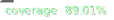

# M3 UI React

M3 UI is an impressive and user-friendly library of components that follows the Material 3 design system.



> This isn't the official documentation yet, just a help to initiate the development while the documentation is being written.

## Quick setup

### First - Install

```console
npm i m3-ui-react
```

### Second - styling

Import the required stylesheet into `RootLayout` or your `(main|index).ts`:

```js
import 'm3-ui-react/dist/m3-ui.css';
```

To make use of `Icon` component, it is necessary to import the icon font stylesheet too, according to the style chosen:

```js
// Outlined
import 'm3-ui-react/dist/m3-ui.icon-outlined.css';
// Rounded
import 'm3-ui-react/dist/m3-ui.icon-rounded.css';
// Sharp
import 'm3-ui-react/dist/m3-ui.icon-sharp.css';
```

### Third - Theming

For correct use of the components and to customize the interface, it is necessary to fill some CSS variables. You have some utils to do this task.

You just need to pass the main color of your interface, the color scheme (“light” or “dark”) and the font face names and the util will make the job.

> More info about theme utils in the [Theme](#theme) section of this page.

For each necessity, a specific util is applied:

#### With Next.js

In this case, the right way is to set these vars on server side, with the `RootLayout`:

```jsx
import { applyThemeOnHtmlStyleTag } from 'm3-ui-react/theme';
...

return (
  <html
    style={applyThemeOnHtmlStyleTag({
      seedColor: '#4285F4', // main color as hex
      colorScheme: 'dark', // the recommendation is to use a cookie value
      font: { // if you prefer to make use of Next.js font variable, just set `false` here
        title: '"Roboto"', // or set the `--font-title` var
        content: '"Roboto"', // or set the `--font-content` var
        code: '"Roboto Mono"', // or set the `--font-code` var
      },
    })}
  >
    <body>{children}</body>
  </html>
);
```

#### With client

In this case, call the `applyTheme` util into `(main|index).tsx`:

```jsx
import { applyTheme } from 'm3-ui-react/theme';
// before createRoot
applyTheme({
  seedColor: '#4285F4',
  colorScheme: 'light',
  font: {
    title: '"Roboto"',
    content: '"Roboto"',
    code: '"Roboto Mono"',
  },
});
```

Setup done! Just start to make use.

## Components

This list is organized according to [Material Docs](https://m3.material.io/components).

### Buttons

- [x] Button
- [x] IconButton
- [ ] FloatActionButton (__coming soon__)
- [ ] _SegmentedButton (planning)_

### Date and time pickers

- [ ] _DatePicker (planning)_
- [ ] _TimePicker (planning)_

### Loading and progress

- [ ] _Progress (planning)_

### Navigation

- [x] NavLink
- [x] NavBar
- [x] NavRail

### Sheets

- [x] SideSheet
- [ ] BottomSheet (__coming soon__)

### Others

- [x] Appbar
- [ ] _Badges (planning)_
- [x] CanonicalLayout
- [x] Card
- [x] CardMedia
- [ ] _Carousel (planning)_
- [ ] Checkbox (__coming soon__)
- [ ] Chip (__coming soon__)
- [x] Content
- [x] Dialog
- [x] Divider
- [ ] _FloatToolbar (planning)_
- [x] Font
- [x] Icon
- [x] ListItem
- [x] Menu
- [ ] RadioButton (__coming soon__)
- [ ] _RichTooltip (planning)_
- [ ] Search (__coming soon__)
- [ ] _SelectField (planning)_
- [ ] Snackbar (__coming soon__)
- [x] Switch
- [ ] _Slider (planning)_
- [ ] Tabs (__coming soon__)
- [ ] TextField (__coming soon__)
- [x] Tooltip

## Theme

These functions will help you to create dynamic color schemes by the content-based color of your product/application.

### `applyThemeOnHtmlStyleTag`

> Solution to server side render

This function returns the CSS variables required to customize the library components as `CSSProperties` and need to be applied in the `style` _prop_ of the `<html>` tag.

```jsx
import { applyThemeOnHtmlStyleTag } from 'm3-ui-react/theme';
...

return (
  <html
    style={applyThemeOnHtmlStyleTag({
      seedColor: '#4285F4',
      colorScheme: 'dark',
      font: {
        title: '"Roboto"',
        content: '"Roboto"',
        code: '"Roboto Mono"',
      },
    })}
  >
    <body>{children}</body>
  </html>
);
```

#### `applyThemeOnHtmlStyleTag` types

```ts
type FontSettings = {
  title?: string;
  content?: string;
  code?: string;
};

type Settings = {
  seedColor: string; // content-based color of your product/application
  colorScheme: 'dark' | 'light;
  font: FontSettings | false;
}

function applyThemeOnHtmlStyleTag(settings: Settings): CSSProperties
```

### `applyTheme`

> Solution to client side render

This function applies the CSS variables required to customize the library components in the document element.

```jsx
import { applyTheme } from 'm3-ui-react/theme';
// before createRoot
applyTheme({
  seedColor: '#4285F4',
  colorScheme: 'light',
  font: {
    title: '"Roboto"',
    content: '"Roboto"',
    code: '"Roboto Mono"',
  },
});
```

#### `applyTheme` types

```ts
type FontSettings = {
  title?: string;
  content?: string;
  code?: string;
};

type Settings = {
  seedColor: string; // content-based color of your product/application
  colorScheme: 'dark' | 'light;
  font: FontSettings | false;
}

function applyTheme(settings: Settings): void
```
