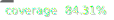

# M3 UI React

M3 UI is an impressive and user-friendly library of components that follows the Material 3 design system.



> This is a preliminary guide to help you get started while the official documentation is being prepared.

## Quick setup

### First - Installation

```console
npm i m3-ui-react
```

### Second - Styling

Import the required stylesheet into `RootLayout` or your `(main|index).ts`:

```js
import 'm3-ui-react/dist/m3-ui.css';
```

To use the `Icon` component, you must also import the corresponding icon font stylesheet:

```js
// Outlined
import 'm3-ui-react/dist/m3-ui.icon-outlined.css';
// Rounded
import 'm3-ui-react/dist/m3-ui.icon-rounded.css';
// Sharp
import 'm3-ui-react/dist/m3-ui.icon-sharp.css';
```

### Third - Theming

To properly use and customize the components, you need to set some CSS variables. These utilities simplify the process by handling the configuration for you.

Simply provide your brand color, desired color scheme ("light" or "dark"), and font preferences, and the utility will apply all necessary styles.

> More info about theme utils in the [Theme](#theme) section of this page.

Choose the appropriate utility for your use case:

#### With Next.js

In this case, the right way is to set these vars on server side, with the `RootLayout`:

```jsx
import { applyThemeOnHtmlStyleTag } from 'm3-ui-react/theme';
...

return (
  <html
    style={applyThemeOnHtmlStyleTag({
      seedColor: '#4285F4', // main color as hex
      colorScheme: 'dark', // the recommendation is to use a cookie value
      font: { // if you prefer to make use of Next.js font variable, just set `false` here
        title: '"Roboto"', // or set the `--font-title` var
        content: '"Roboto"', // or set the `--font-content` var
        code: '"Roboto Mono"', // or set the `--font-code` var
      },
    })}
  >
    <body>{children}</body>
  </html>
);
```

#### With client

In this case, call the `applyTheme` util into `(main|index).tsx`:

```jsx
import { applyTheme } from 'm3-ui-react/theme';
// before createRoot
applyTheme({
  seedColor: '#4285F4',
  colorScheme: 'light',
  font: {
    title: '"Roboto"',
    content: '"Roboto"',
    code: '"Roboto Mono"',
  },
});
```

You're all set! Start using the library.

## Components

- [x] Appbar
- [ ] _Badges (planning)_
- [ ] BottomSheet (__coming soon__)
- [x] Button
- [x] CanonicalLayout
- [x] Card
- [x] CardMedia
- [ ] _Carousel (planning)_
- [x] Checkbox
- [x] Chip
- [x] Content
- [ ] _DatePicker (planning)_
- [x] Dialog
- [x] Divider
- [ ] _FloatToolbar (planning)_
- [ ] FloatActionButton (__coming soon__)
- [x] Font
- [x] Icon
- [x] IconButton
- [x] Input
- [x] ListItem
- [x] Menu
- [x] NavBar
- [x] NavLink
- [x] NavRail
- [ ] _Progress (planning)_
- [ ] RadioButton (__coming soon__)
- [ ] _RichTooltip (planning)_
- [ ] Search (__coming soon__)
- [ ] _SegmentedButton (planning)_
- [x] Select
- [x] SideSheet
- [ ] Snackbar (__coming soon__)
- [x] Switch
- [ ] _Slider (planning)_
- [ ] Tabs (__coming soon__)
- [ ] _TimePicker (planning)_
- [x] Tooltip

## Theme

These functions will help you to create dynamic color schemes by the content-based color of your product/application.

### `applyThemeOnHtmlStyleTag`

> Solution to server side render

This function returns the CSS variables required to customize the library components as `CSSProperties` and need to be applied in the `style` _prop_ of the `<html>` tag.

```jsx
import { applyThemeOnHtmlStyleTag } from 'm3-ui-react/theme';
...

return (
  <html
    style={applyThemeOnHtmlStyleTag({
      seedColor: '#4285F4',
      colorScheme: 'dark',
      font: {
        title: '"Roboto"',
        content: '"Roboto"',
        code: '"Roboto Mono"',
      },
    })}
  >
    <body>{children}</body>
  </html>
);
```

#### `applyThemeOnHtmlStyleTag` types

```ts
type FontSettings = {
  title?: string;
  content?: string;
  code?: string;
};

type Settings = {
  seedColor: string; // content-based color of your product/application
  colorScheme: 'dark' | 'light';
  font: FontSettings | false;
}

function applyThemeOnHtmlStyleTag(settings: Settings): CSSProperties
```

### `applyTheme`

> Solution to client side render

This function applies the CSS variables required to customize the library components in the document element.

```jsx
import { applyTheme } from 'm3-ui-react/theme';
// before createRoot
applyTheme({
  seedColor: '#4285F4',
  colorScheme: 'light',
  font: {
    title: '"Roboto"',
    content: '"Roboto"',
    code: '"Roboto Mono"',
  },
});
```

#### `applyTheme` types

```ts
type FontSettings = {
  title?: string;
  content?: string;
  code?: string;
};

type Settings = {
  seedColor: string; // content-based color of your product/application
  colorScheme: 'dark' | 'light';
  font: FontSettings | false;
}

function applyTheme(settings: Settings): void
```
